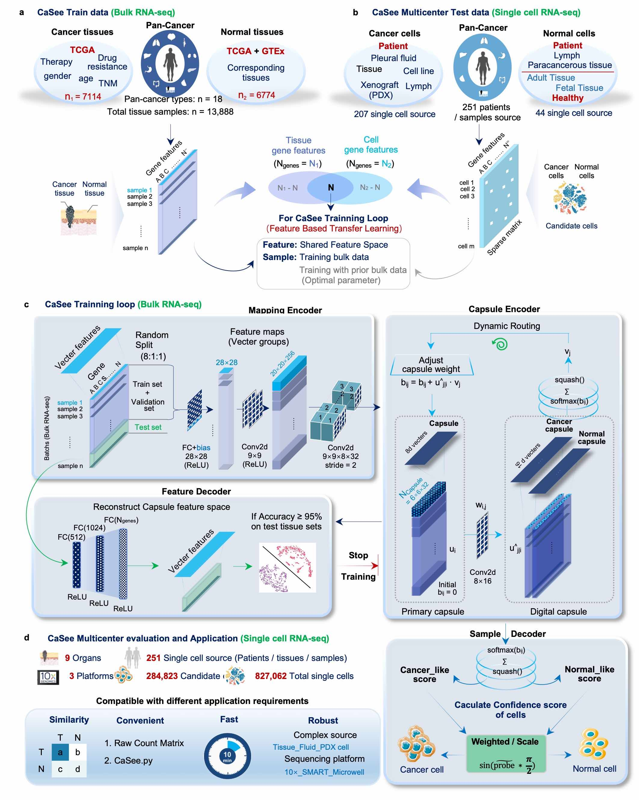

# CaSee: Used in Sc-expr Matrix to identify Cancer cells 

The most important things for single cell RNA sequencing of human cancer is to identify which is cancer or normal cell. However in the present, the common method is to evaluate copy number variation (CNV). These methods which are based on the principle that CNV is common in human cancers about 85%.  And these methods are based on expression data to inferred CNV, so there is a certain error (~20%) with actual genome copy number compilation.Therefore, we developed CaSee, a tumor cell discrimination model based on deep learning framework. Compared with the traditional copy number variation (CNV) method, CaSee is the first discrimination tool directly used to discriminate cancer/normal cells from scRNA-seq expression matrix, and the discrimination efficiency and robustness are much higher than that of CNV method. CaSee is user friendly and can adapt to a variety of data sources, including but not limited to scRNA tissue sequencing data, scRNA cell line sequencing data, scRNA xenograft cell sequencing data as well as scRNA circulating tumor cell sequencing data; It is compatible with mainstream sequencings technology platforms, such as 10x Genomics, smart-seq2, and microwell-seq and so on.   In the data analysis of GSE131907, we know that the inferCNV method can indeed give accurate discrimination results. However, it has strict requirements for data and after the threshold filter, some cells will be dropped. CaSee method can solve these two problems well. In scRNA-seq data analysis, we do not state that CaSee pipeline could replace the role of CNV methods, but CaSee can completely and perfectly replace the role of cancer/normal cell discrimination, which could let each method performs its own functions. CaSee has stronger performance and better professionalism in cancer cell identification.

<div align='center' ><b><font size='150'>Overview of CaSee pipeline</font></b></div>
  


## Download data

Clone the repo Download the Data_input folder from the link below into the repo:
https://drive.google.com/drive/folders/1Z3ynvzmTwkFWsFRnpzrwMwJkQxMqES4_?usp=sharing

refdata is required 
https://drive.google.com/file/d/1zFepfrnfOzF3EjK6i-ge3s_w-5Q4Jw8n/view?usp=sharing

> 若您在中国大陆的话，可以通过下面的邮件地址联系我，我用百度网盘发您
> 链接: https://pan.baidu.com/s/1BYxLTwn1JeFOH5LD3jt1_w  密码: i556

### Dataset summary 
| Summary of Single-Cell Data |             |                           |           |        |                   |                                   |                         |                                                                                      |
| --------------------------- | ----------- | ------------------------- | --------- | ------ | ----------------- | --------------------------------- | ----------------------- | ------------------------------------------------------------------------------------ |
|                             | Cancer_Typy | Cell_Origin               | n_samples | nCells | nCandidate_Cancer | Using_weight_Predict              | Similarity_With_Article | Link                                                                                 |
| CTC                         | Breast      | hydrothorax               | 1         | 3      | 3                 | FALSE                             | 100.00%                 |                                                                                      |
| GSE116237                   | Melanoma    | patient-derived xenograft | 4         | 674    | 674               | TRUE                              | 100.00%                 | https://www.ncbi.nlm.nih.gov/geo/query/acc.cgi?acc=GSE116237                         |
| GSE131907                   | Lung        | tissue                    | 58        | 208506 | 36467             | FALSE                             | 94.14%                  | https://www.ncbi.nlm.nih.gov/geo/query/acc.cgi?acc=GSE131907                         |
| GSE132465                   | Colorectal  | tissue                    | 33        | 63689  | 18539             | FALSE                             | 92.59%                  | https://www.ncbi.nlm.nih.gov/geo/query/acc.cgi?acc=GSE132465                         |
| GSM4476490_TNBC5            | TNBC        | tissue                    | 1         | 3225   | 2616              | TRUE                              | 97.63%                  | https://www.ncbi.nlm.nih.gov/geo/query/acc.cgi?acc=GSM4476490                        |
| GSM4476486_TNBC1            | TNBC        | tissue                    | 1         | 1097   | 801               | TRUE                              | 98.75%                  | https://www.ncbi.nlm.nih.gov/geo/query/acc.cgi?acc=GSM4476486                        |
| GSM4476485_DCIS1            | TNBC        | tissue                    | 1         | 1480   | 1183              | TRUE                              | 86.73%                  | https://www.ncbi.nlm.nih.gov/geo/query/acc.cgi?acc=GSM4476485                        |
| GSM5074416_IDC1             | IDC         | tissue                    | 1         | 2831   | 2444              | TRUE                              | 99.96%                  | https://www.ncbi.nlm.nih.gov/geo/query/acc.cgi?acc=GSM5074416                        |
| GSM5074417_IDC2             | IDC         | tissue                    | 1         | 3378   | 2875              | TRUE                              | 99.62%                  | https://www.ncbi.nlm.nih.gov/geo/query/acc.cgi?acc=GSM5074417                        |
| GSM4476487_TNBC2            | TNBC        | tissue                    | 1         | 1034   | 589               | TRUE                              | 100.00%                 | https://www.ncbi.nlm.nih.gov/geo/query/acc.cgi?acc=GSM4476487                        |
| GSM4476489_TNBC4            | TNBC        | tissue                    | 1         | 3056   | 1183              | TRUE                              | 96.62%                  | https://www.ncbi.nlm.nih.gov/geo/query/acc.cgi?acc=GSM4476489                        |
| GSM4476488_TNBC3            | TNBC        | tissue                    | 1         | 532    | 234               | TRUE                              | 76.50%                  | https://www.ncbi.nlm.nih.gov/geo/query/acc.cgi?acc=GSM4476488                        |
| GSE150949_pc9               | Lung        | cell_line                 | 8         | 56419  | 56419             | TRUE                              | 99.99%                  | https://www.ncbi.nlm.nih.gov/geo/query/acc.cgi?acc=GSE150949                         |
| GSE150949_Watermelon        | Lung        | cell_line                 | 8         | 50735  | 50735             | TRUE                              | 99.69%                  | https://www.ncbi.nlm.nih.gov/geo/query/acc.cgi?acc=GSE150949                         |
| PRJNA591860                 | Lung        | tissue                    | 56        | 27489  | 5581              | FALSE                             | 85.76%                  | https://drive.google.com/drive/folders/1sDzO0WOD4rnGC7QfTKwdcQTx3L36PFwX?usp=sharing |
| PMID33958794_cohort1        | Breast      | tissue                    | 31        | 175943 | 55432             | FALSE                             | 79.19%                  | http://biokey.lambrechtslab.org/                                                     |
| PMID33958794_cohort2        | Breast      | tissue                    | 11        | 50693  | 10453             | FALSE                             | 72.77%                  | http://biokey.lambrechtslab.org/                                                     |
| Liver_Camp                  | Liver       | tissue                    | 1         | 303    | 160               | TRUE                              | 100.00%                 | https://db.cngb.org/HCL/                                                             |
| Adult-Liver4                | Liver       | tissue                    | 1         | 4384   | 325               | TRUE                              | 100.00%                 | https://db.cngb.org/HCL/                                                             |
| Adult-Liver2                | Liver       | tissue                    | 1         | 4377   | 466               | TRUE                              | 100.00%                 | https://db.cngb.org/HCL/                                                             |
| Adult-Liver1                | Liver       | tissue                    | 1         | 1811   | 163               | TRUE                              | 100.00%                 | https://db.cngb.org/HCL/                                                             |
| Adult-Lung1                 | Lung        | tissue                    | 1         | 8427   | 3460              | TRUE                              | 100.00%                 | https://db.cngb.org/HCL/                                                             |
| Adult-Lung3                 | Lung        | tissue                    | 1         | 9604   | 1991              | TRUE                              | 100.00%                 | https://db.cngb.org/HCL/                                                             |
| Adult-Lung2                 | Lung        | tissue                    | 1         | 5850   | 1788              | TRUE                              | 97.04%                  | https://db.cngb.org/HCL/                                                             |
| Fetal-Lung1                 | Lung        | tissue                    | 1         | 4527   | 16                | TRUE                              | 100.00%                 | https://db.cngb.org/HCL/                                                             |
| Fetal-Stomach1              | Stomach     | tissue                    | 1         | 1322   | 504               | TRUE                              | 100.00%                 | https://db.cngb.org/HCL/                                                             |
| Fetal-Stomach2              | Stomach     | tissue                    | 1         | 6631   | 629               | TRUE                              | 100.00%                 | https://db.cngb.org/HCL/                                                             |
| Adult-Stomach1              | Stomach     | tissue                    | 1         | 1879   | 1479              | TRUE                              | 100.00%                 | https://db.cngb.org/HCL/                                                             |
| Adult-Stomach2              | Stomach     | tissue                    | 1         | 4669   | 1261              | TRUE                              | 100.00%                 | https://db.cngb.org/HCL/                                                             |
| Adult-Stomach3              | Stomach     | tissue                    | 1         | 8005   | 6336              | TRUE                              | 100.00%                 | https://db.cngb.org/HCL/                                                             |
| PMID34663877                | Lung        | tissue                    | 20        | 114489 | 20017             | FALSE                             | 79.06%                  | https://codeocean.com/capsule/8321305/tree/v1                                        |
|                             |             |                           |           |        |                   | Avg all (Except : PMID33958794) = | 96.69%                  |                                                                                      |
|                             |             |                           |           |        |                   | Avg  (Except : PMID33958794) =    | 92.28%                  |                                                                                      |

## Pre-requisites:

- Linux (Based on Ubuntu 20.04 LTS, Personal Computer) 
- CPU AMD Ryzen 9 3950X
- NVIDIA GeForce RTX 3090 24GB 384bit 1695MHz 19500MHz 
- Memory 128G (32GB*4) DDR4 3200MHz

### Environment and resource allocation

---

For instructions on installing anaconda on your machine (download the distribution that comes with python 3):
https://www.anaconda.com/distribution/

```
#conda env create -n CaSee -f configs/CaSee_env_info.yaml

# if there are some warnings or errors 
# you can manually install some main packages
# all pip software in all_pip_pacakges.yaml
conda create -n CaSee python==3.8.8 # python==3.8
conda activate CaSee

pip install pytorch-lightning==1.3.7 # -i https://pypi.tuna.tsinghua.edu.cn/simple
pip install scipy==1.7.0 # -i https://pypi.tuna.tsinghua.edu.cn/simple
pip install numpy==1.20.3 # -i https://pypi.tuna.tsinghua.edu.cn/simple
pip install scanpy==1.7.2 # -i https://pypi.tuna.tsinghua.edu.cn/simple
pip install scikit-learn==0.23.2 # -i https://pypi.tuna.tsinghua.edu.cn/simple
pip3 install opencv-python==4.5.2.54 # -i https://pypi.tuna.tsinghua.edu.cn/simple
pip install torchmetrics==0.3.2 # -i https://pypi.tuna.tsinghua.edu.cn/simple
pip install torchvision==0.10.0 # -i https://pypi.tuna.tsinghua.edu.cn/simple

```

And you also download pytorch https://pytorch.org/ 

Attention, if you in the Chinese mainland, plz use `pip install` instand `conda install` 

**Ubuntu**

```
pip3 install torch==1.9.0+cu111 torchvision==0.10.0+cu111 torchaudio==0.9.0 -f https://download.pytorch.org/whl/torch_stable.html


```

**MacOS**

```
pip3 install torch==1.9.0 torchvision==0.10.0 torchaudio==0.9.0


```

**Windos**

```
pip3 install torch==1.9.0+cu111 torchvision==0.10.0+cu111 torchaudio==0.9.0 -f https://download.pytorch.org/whl/cu111/torch_stable.html
```
> torch==1.9.0+cu111  
> torchvision==0.10.0+cu111  
> torchaudio==0.9.0

~~Next, use the environment configuration file located in **configs/CaSee_env_info.yaml** to create a conda environment:~~

~~**It will take several minutes or hours depending on the speed of the network. Please be patient.**~~

## Prepare candidate ref data

Download `ref_data.tar.xz` and unzip the file, move the whole `ref_data` into the CaSee program work_dir.

## Prepare model args

The args config file is **configs/CaSee_Model_configs.yaml**

```
# configs of trainning-loop, plz attention this config_file must be in floder named "configs".
# 训练集使用的配置文件，请务必放在configs文件夹下 
# Date: 2021-11-30 14:32:03
# Author: Yuan.Sh
--- 
# training model args
data_arguments: 
  
  # Your data should be stored in work_dir, it can be raw count matrix or candidate cancer cell count matrix
  # The format of matrix must be csv, and the row is genesymbol, the col is cell_id
  work_dir: /media/yuansh/14THHD/BscModel-V4/GSE131907/ 
  
  # Your input file name
  Counts_expr: GSE131907_epi_count.csv # must .csv
  
  # You can give the Tissue_type as you know, Don't worry that the model will use this infomation. this information just use in weight the Probability, if you only use scale Probability, it will not be use.
  Tissue_type: "Tumor" # Tissue type come from ['Tumor','Adjacent','Normal','Unknow']
  
  # when you do not know the marker genes of candidate cancer cells, you can use "elimination method" to get cells. You just set use_others=True
  use_others: False # if you want to use cell cluseter which is not be annotation.
  
  # If you just want to use mRNA in step of cell_annotion, you can set remove_genes=True 
  remove_genes: False # remove mt, rp, ercc, LNC, non-coding RNA

# If you input file is raw count matrix, cell_annotion=True, else cell_annotion=False
# Because CaSee is not applicable in non-candidate cells 
cell_annotion: False    


# "cell exclusion" algorithm
# This is default cells markers, you can use your own marker to define cell cluster.
Marker_genes:
  T_cell: ["CD3D",'CD3E','CD2']
  Fibroblast: ['COL1A1','DCN','C1R']
  Myeloid: ['LYZ','CD68','TYROBP']
  B_cell: ['CD79A','MZB1','MS4A1']
  Endothelial: ['CLDN5','FLT1','RAMP2']
  Mast: ['CPA3','TPSAB1','TPSB2']
  DC: ['LILRA4','CXCR3','IRF7']
  Cancer: ['EPCAM']
  
save_files:
  files: merge_data

# if traing times==1, the p-val will not give. 
# if your expr's gene much different from the referenc matrix. you can choose suitable args of batch_size or lr
trainig_loop:
  times: 10
  batch_size: 128  # if GPU not enough, plz set sutiable number  
  max_epochs: 20 # Generally speaking 20 epochs is enough to get the result, if can't plz set sutiable number
  seed: 42
  lr: 0.0005 
  split_data_seed: 0
  gpu:True 
ckpt: 

```

## Running Model

```
python CaSee.py --config configs/CaSee_Model_configs.yaml
```

users can run jupyter notebook to create your own Customization pipeline

and all the following analysis was deposited in Google link (above).

especially, GSE131907 reproduction code was deposited in `GSE131907_example`

## Reproduce

**GSE131907 as example**

before you starting, you can makdir `CaSee_Reproduce`

and the, download the files deposit in google drive, `ref_data.tar.xz` and `GSE131907` in `CaSee_Reproduce`

then check md5sum

- 21b2bf676d834ef7a6215219c7bb4a53  GSE131907.tar.xz

- 4faaef9a5c87fa0896d00cdbed7efd31  ref_data.tar.xz
 
 
then move the `ref_data` to CaSee model work directory `CaSee-main`

next, you only modify the 'work_dir' in `CaSee_Reproduce/CaSee_Model_configs.yaml` for your own.

then run

```bash
python CaSee.py --config /home/yuansh/Desktop/CaSee_Reproduce/CaSee_Model_configs.yaml
```


## Contact

if you have any question about CaSee, plz sent E-mail to me

i will back you in 24 hours

```

No. 2#110, North District,
School of Basic Medical Sciences,
Fujian Medical University,
Fuzhou, Fujian, China.
please contact with me via the following ways:
(a) e-mail :yuansh3354@163.com
9:30 am - 2:00 am
---------------------------------------
Best Regards,
Yuan.SH
---------------------------------------

For Chines student:
如果文献看不懂或者不会用的话可以等一等，我到时候会在B站上录制相关的视频
以及可以关注一下我的个人博客：https://blog.csdn.net/qq_40966210/category_11165022.html
```

